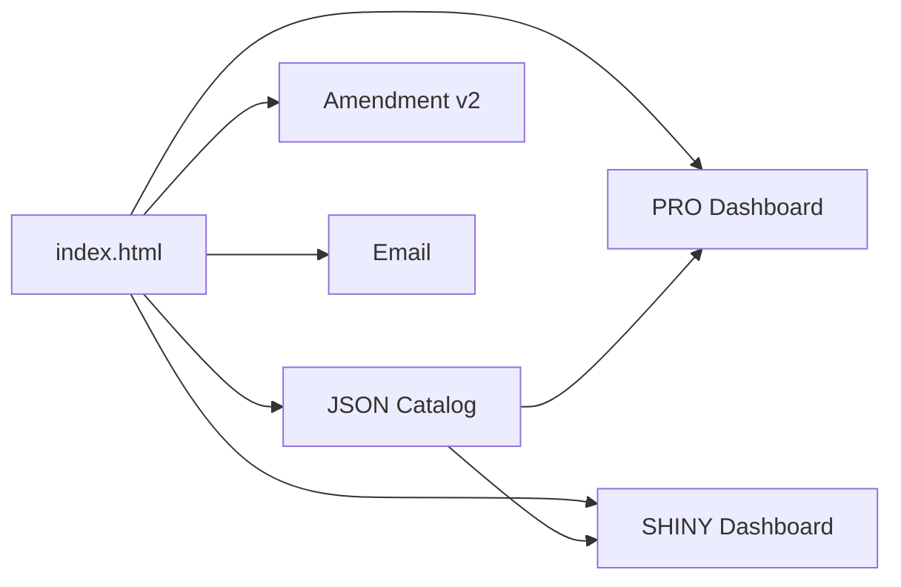

# Twilio Negotiation — Enterprise Portal

**Mission (for Codex):** publish an executive-grade negotiation site on GitHub Pages with:
- PRO/SHINY dashboards (start-date alignment, **ladder 32→37→45%**, CPE/CPC, 24-month projection)
- JSON catalog (seeded here; expand later)
- Legal amendment (Sep 15 start, **75% credit**, ladder, 2-year term)
- Paste-ready email

